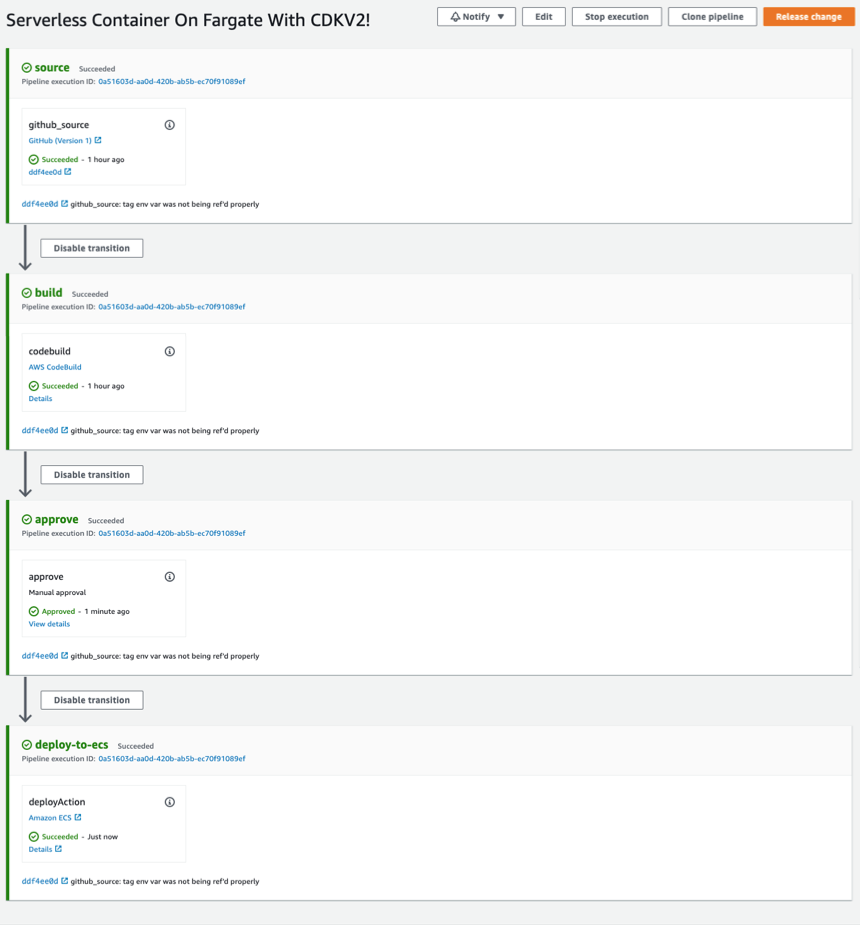

# Load Balanced ECS/Fargate Micro Service

This repo contains both the infrastructure and application code required to deploy a fully self contained micro service to AWS. 

The infrastructure uses the AWS CDK to descibe its infrastructure using typescript. 

Read More About the CDK [Here](https://aws.amazon.com/cdk/). 

# Overview

**Inital Deploy Creates**
- VPC 
- ALB
- ALB Target Group  
- Codebuild Project With Github Webhook Listener 
- ECS Cluster with Port mappings from ALB target group 
- ECR Repo 

The first deploy also builds the initial container as defined in `/node-app`, for the first ecs task creation. 

**After Intial Deploy**

After the first deployment, Github Webhooks are used to trigger deployments. This is setup by the infrastructure code, the CodeBuild project created on the first deploy is the mechanism that listens for the Github Webhooks. 


The infrastructure code will build a pipeline with 4 stages, as shown below. After the first infrastructure deploy, the container that holds the webapp can be developed and built for production independently.

The build steps:



# Prerequisites

All of the setup steps assume you have a recent version of the aws cli configured on the machine you are working on, with the properly scoped permissions to complete the steps. See [setup on the aws website](https://docs.aws.amazon.com/cli/latest/userguide/getting-started-install.html) for help if you do not have this setup. 

# Setup

### 1. Github Repo

Navigate to github.com and create a repository for this codebase to live in.

### 2. Create Github Token

Using the Github website, navigate to Settings/Developer Settings/Personal access tokens, create a new token with the following permissions:

**admin:repo_hook**   
**admin:org_hook**   
**repo** 

### 3. Store Token Securly

Use AWS Secrets manager for easy and secure token storage. 

```bash
aws configure set region $AWS_REGION
aws secretsmanager create-secret \
 --name <SECRET_NAME> \
 --secret-string <GITHUB_TOKEN>
 ```

Once the above command is run, check if the secret is stored as expected using below command:


 ```
 aws secretsmanager get-secret-value \
    --secret-id <SECRET_NAME> \
    --version-stage AWSCURRENT
```

You should get something similar to the following output:

```json
{
    "ARN": "<arn>",
    "Name": "<token_name>",
    "VersionId": "<version_id>",
    "SecretString": "<token_value>",
    "VersionStages": [
        "AWSCURRENT"
    ],
    "CreatedDate": "<create_date>"
}

```

### 4. Authorize CodeBuild
It is neccessary to authorize code build to create the hook in Github which will trigger deployments through your Code Pipeline. Replace with your GitHub Personal Access Token in the following snippet and run the following in you development environment.

```bash
aws codebuild import-source-credentials \
    --server-type GITHUB \
    --auth-type PERSONAL_ACCESS_TOKEN \
    --token <GITHUB_TOKEN>
```
Verify the credential import worked.

```bash
aws codebuild list-source-credentials 
```
The above command should produce something similar to the below output. 

```json
{
    "sourceCredentialsInfos": [
        {
            "arn": "<arn>",
            "serverType": "GITHUB",
            "authType": "PERSONAL_ACCESS_TOKEN"
        }
    ]
}
```


# Deploying Infrastructure 
```
cd infra
npm install
npm run build
```

Depending on the AWS account you're deploying to, you may also need to run these commands:

```bash
cdk ls
cdk bootstrap aws://$AWS_ACCOUNT/$AWS_REGION
```

First, synthesize the cloudformation template to build the cloudformation template (if first deploy), or build and capture cloudformation diff (subsequent deploys):

```bash
cdk synth
``` 

Finally, deploy the stack passing in the 

```bash
cdk deploy \
    --parameters githubUserName="<org_or_user_name>" \
    --parameters githubRespository="<repo_name>" \
    --parameters githubPersonalTokenSecretName="<secrets_manager_token_name>" \
    --context stackName="<cfn_stackname>"
```

